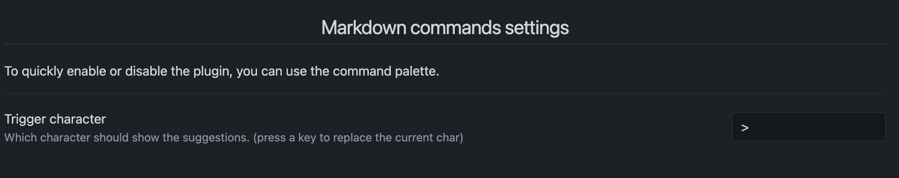
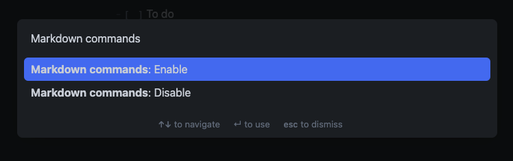

# Obsidian Markdown Commands

This is a plugin for Obsidian (https://obsidian.md).

# Why?

If you're used to software like Notion, going from assisted markdown to plain markdown may be a bit hard if you're not used to it. You'll probably have to work with a [cheatsheet](https://www.markdownguide.org/cheat-sheet/) open in a tab in order to make sure you're not doing it wrong.  
Also some syntaxes are a bit cumbersome to write like the [table](https://www.markdownguide.org/cheat-sheet/#extended-syntax) one.

So, if you're learning markdown or too lazy to write a table, this plugin is for you.

# How it works?

## Show the commands

All you have to do is to write a `>` whenever you want in a file, then make your choice.

## Configure the plugin

You can enable or disabled the plugin and even change the character that will trigger the commands

 

You can also enable or disable from the [command palette](https://help.obsidian.md/Plugins/Command+palette#:~:text=The%20Command%20Palette%20is%20enabled,in%20on%20the%20right%20side.).

# How to install?

First, you need to have `Obsidian v0.12.17+`.

-   Go to `Settings > Community plugins`
-   Turn safe mode to `off`
-   Go to the [releases page](https://github.com/JulesGuesnon/obsidian-markdown-commands/releases)
-   Download the latest `markdown-commands-<version>.zip`
-   Put the zip into `<vault-folder>/.obsidian/plugins` (if the folder plugins doesn't exist you can create it)
-   Extract it
-   Enable the plugin in the settings and you're ready to go

    

# Any issue or suggestion?

If you're facing an issue feel free to [open a new one](https://github.com/JulesGuesnon/obsidian-markdown-commands/issues/new) and describe as much as possible the issue, the context of the issue, etc...

If you think that the plugin is missing something or could be improved, feel free to [open an issue](https://github.com/JulesGuesnon/obsidian-markdown-commands/issues/new) and describe your idea.
